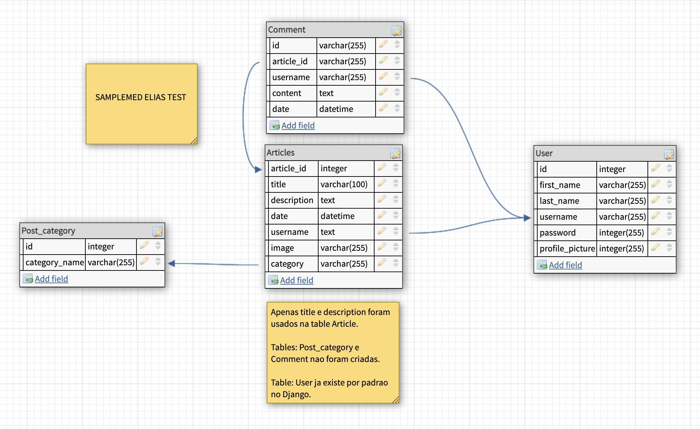

## Samplemed Elias teste

### Perguntas

Voce pode ir para as [perguntas aqui](samplemed_test_files/perguntas.md)

### Estrutura do projeto

O projeto foi separado em dois repositorios `backend/` e `frontend/`. Onde backend esta configurado toda API restful usando Django e o sub-framework restful-api. No folder frontend esta configurado react.js fazendo chamadas com `localhost` urls.

## Database Design

